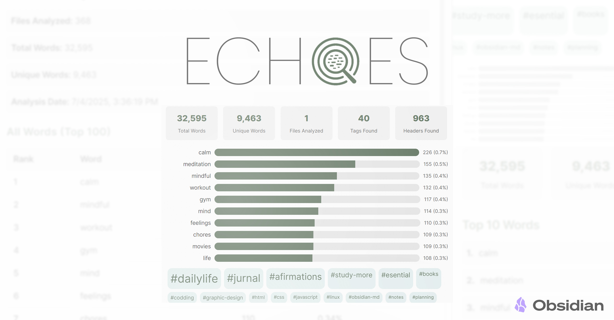
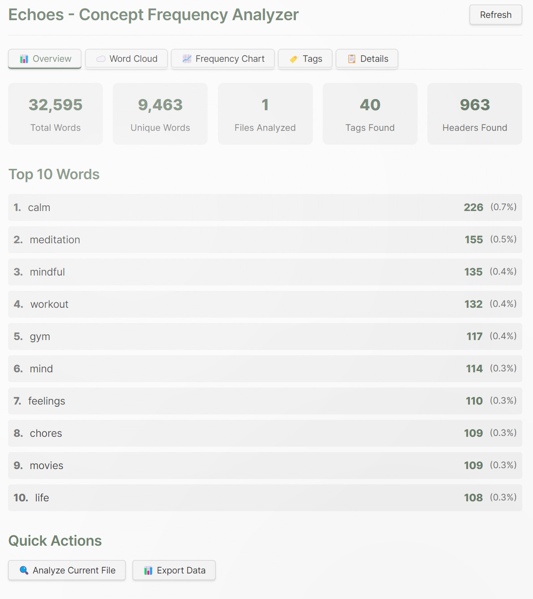
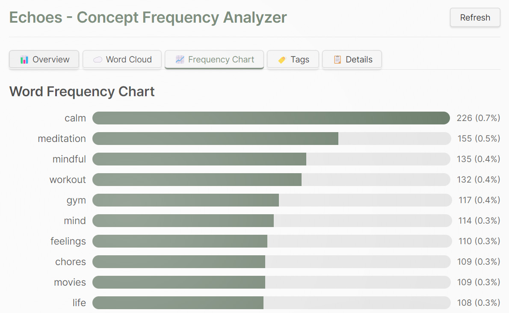
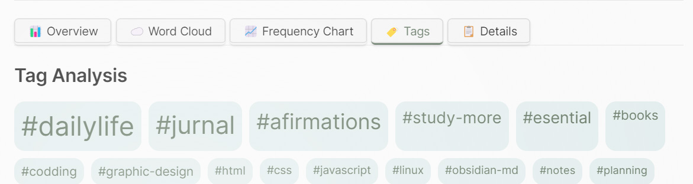
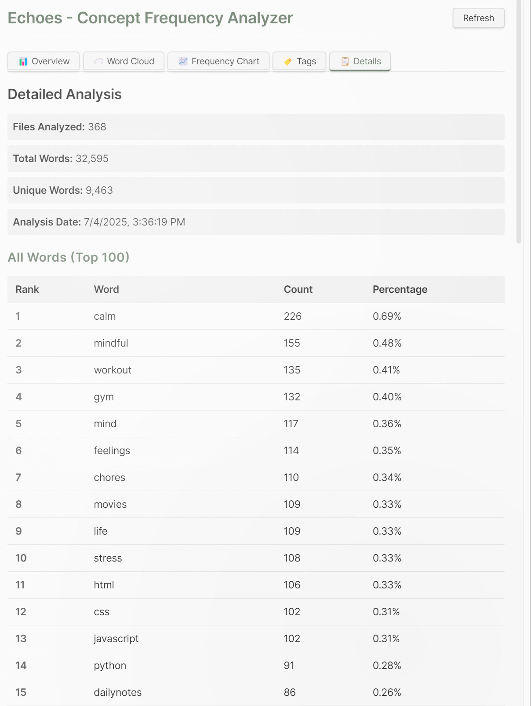

# Echoes - Concept Frequency Analyzer

[](https://obsidian.md/)
[](https://typescriptlang.org/)
[](https://opensource.org/licenses/MIT)

See the hidden patterns in your notes! Echoes scans your entire Obsidian vault to reveal dominant concepts through word clouds and comprehensive statistics, instantly showing you what matters most in your knowledge collection.

## ✨ Features

### 📊 **Multi-View Analysis**
- **Overview Dashboard**: Quick stats and top words summary
- **Word Cloud**: Beautiful visual representation of word frequencies
- **Frequency Charts**: Bar charts showing detailed word distributions
- **Tag Analysis**: Dedicated analysis of your hashtags
- **Detailed Reports**: Comprehensive analysis with exportable data

### 🎯 **Smart Text Processing**
- Analyzes all markdown files in your vault
- Intelligently parses markdown content (removes code blocks, formatting, etc.)
- **Full Romanian diacritics support** (ăâîșț) - words like "emoție" are processed correctly
- Extracts and analyzes hashtags separately
- Processes headers and content with configurable inclusion
- Filters out common stop words and short words in both Romanian and English

### 🎨 **Rich Visualizations**
- Interactive word clouds with hover tooltips
- Responsive bar charts showing frequency distributions
- Tag clouds with size-based frequency representation
- Statistics dashboard with key metrics

### ⚙️ **Configurable Settings**
- Minimum word length filtering
- Maximum words to display in visualizations
- Custom exclude words list
- Toggle hashtag and header inclusion
- Auto-refresh interval settings

### 📤 **Data Export**
- Export analysis results as JSON
- Save frequency data for external analysis
- Timestamped analysis snapshots






## 🚀 Installation

### Manual Installation

1. Download the latest release from [GitHub](https://github.com/Vlad3Design/echoes)
2. Extract the files to your vault's plugins folder: `VaultFolder/.obsidian/plugins/echoes/`
3. Reload Obsidian
4. Enable the plugin in Settings → Community Plugins

### Building from Source

1. Clone this repository: `git clone https://github.com/Vlad3Design/echoes.git`
2. Install dependencies: `npm install`
3. Build the plugin: `npm run build`
4. Copy `main.js`, `manifest.json`, and `styles.css` to your vault's plugins folder

## 📖 Usage

### Getting Started

1. **Open Echoes**: Click the bar chart icon in the left ribbon or use the command palette (`Ctrl/Cmd + P`) and search for "Open Echoes Analyzer"

2. **Analyze Your Vault**: Click the "Refresh" button to analyze all markdown files in your vault

3. **Explore the Results**: Navigate through different tabs to explore various aspects of your content:
   - **Overview**: See key statistics and top words
   - **Word Cloud**: Visual representation of word frequencies
   - **Frequency Chart**: Detailed bar charts
   - **Tags**: Analysis of your hashtags
   - **Details**: Comprehensive data tables

### Commands

- `Open Echoes Analyzer`: Opens the main analysis view
- `Analyze Current File`: Analyzes only the currently open file

### Settings

Access plugin settings through Settings → Plugin Options → Echoes:

- **Minimum Word Length**: Set the minimum character count for words to include
- **Maximum Words**: Limit the number of words shown in visualizations
- **Exclude Words**: Comma-separated list of words to exclude from analysis
- **Include Tags**: Toggle hashtag analysis on/off
- **Include Headers**: Toggle markdown header analysis on/off
- **Auto-refresh Interval**: Set how often analysis refreshes (in milliseconds)

## 🔧 Configuration

### Default Settings

```json
{
  "minWordLength": 3,
  "maxWords": 100,
  "excludeWords": "Extended list with 200+ English and Romanian stop words including: the,and,or,but,și,sau,dar,pentru,cu,de,la,în,pe...",
  "includeTags": true,
  "includeHeaders": true,
  "refreshInterval": 5000
}
```

### Custom Exclude Words

You can customize the exclude words list to filter out domain-specific terms or personal preferences. The default list includes:
- **Common English stop words**: articles, pronouns, prepositions, conjunctions, auxiliary verbs
- **Romanian stop words**: cuvinte de legătură, prepoziții, pronume, verbe auxiliare, conjuncții
- **Extended vocabulary**: time expressions, common adjectives, greetings, and other non-essential words

This comprehensive filter ensures that only meaningful content words appear in your analysis, making the results more relevant and insightful for both English and Romanian texts.

## 🎨 Styling

The plugin respects Obsidian's theme system and uses CSS variables for consistent styling. It automatically adapts to both light and dark themes.

## 🔌 API

The plugin exposes several classes that can be used by other plugins:

- `FrequencyAnalyzer`: Core text analysis functionality
- `WordCloudGenerator`: Visualization generation
- `EchoesView`: Main UI component

## 🐛 Troubleshooting

### Common Issues

**Analysis not updating**: Try clicking the Refresh button manually or check the auto-refresh interval setting.

**Empty results**: Ensure your vault contains markdown files with sufficient text content.

**Performance issues**: Reduce the maximum words setting or increase the minimum word length filter.

## 🛠️ Development

### Prerequisites

- Node.js (v16 or higher)
- npm or yarn
- TypeScript

### Setup

```bash
# Clone the repository
git clone https://github.com/your-username/echoes-obsidian-plugin.git
cd echoes-obsidian-plugin

# Install dependencies
npm install

# Start development mode
npm run dev
```

### Building

```bash
# Build for production
npm run build

# Type checking
npm run type-check
```

### Project Structure

```
echoes/
├── src/
│   ├── EchoesView.ts          # Main UI component
│   ├── FrequencyAnalyzer.ts   # Text analysis logic
│   └── WordCloudGenerator.ts  # Visualization components
├── main.ts                    # Plugin entry point
├── manifest.json              # Plugin metadata
├── package.json               # Dependencies and scripts
└── README.md                  # Documentation
```

## 📄 License

This project is licensed under the MIT License - see the [LICENSE](LICENSE) file for details.

## 🤝 Contributing

Contributions are welcome! Please feel free to submit a Pull Request. For major changes, please open an issue first to discuss what you would like to change.

### Development Guidelines

1. Follow TypeScript best practices
2. Maintain consistent code style
3. Add tests for new features
4. Update documentation as needed

## 👨‍💻 Author

**Vlad 3Design**
- GitHub: [@Vlad3Design](https://github.com/Vlad3Design)
- Website: [vlad3d.art](https://vlad3d.art)
- X (Twitter): [@vlad3design](https://x.com/vlad3design)
- Instagram: [@vlad.3design](https://instagram.com/vlad.3design)

*Passionate 3D artist and coder, creating tools that enhance creativity and productivity.*

## 📚 Resources

- [Obsidian Plugin Developer Docs](https://docs.obsidian.md/Plugins/Getting+started/Build+a+plugin)
- [Plugin Repository](https://github.com/Vlad3Design/echoes)
- [Report Issues](https://github.com/Vlad3Design/echoes/issues)

## 🙏 Acknowledgments

- Obsidian team for the excellent plugin API
- D3.js community for visualization inspiration
- Contributors and users who provide feedback and suggestions

---

**Made with ❤️ for the Obsidian community** 
